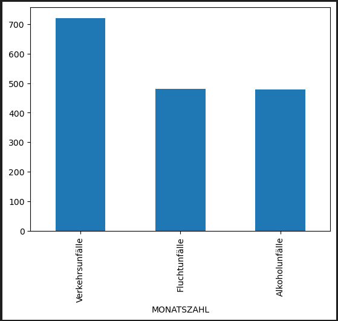
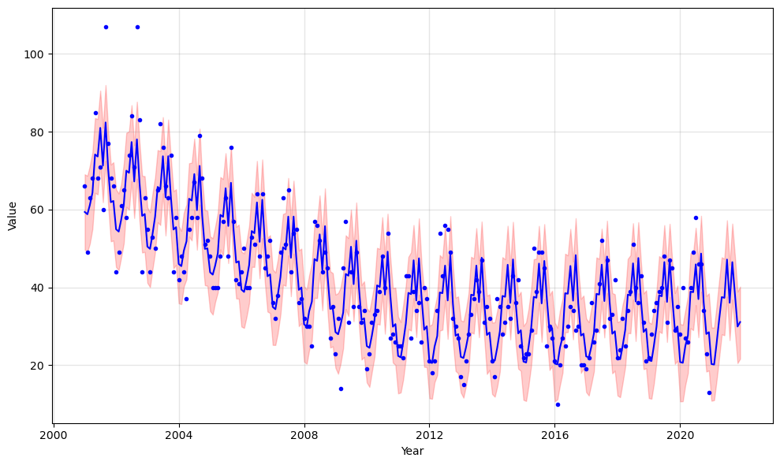
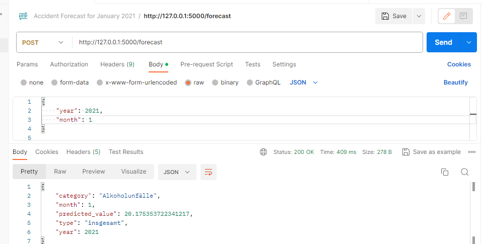
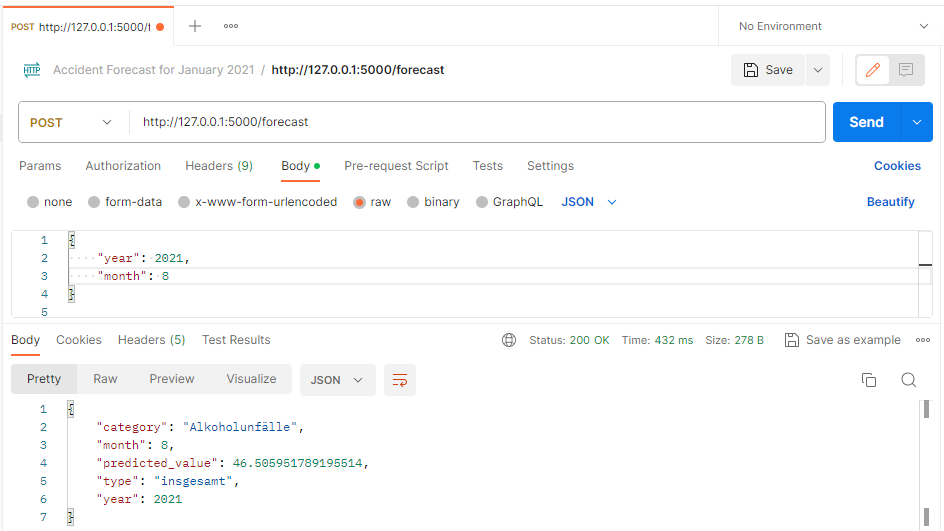
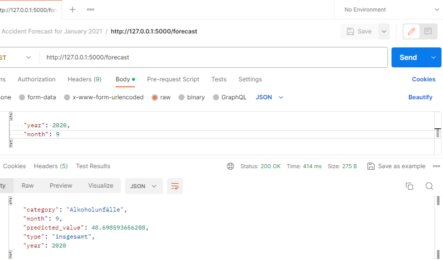

# AI Engineering Challenge Project

This repository contains the solution to the AI Engineering Challenge presented by Digital Product School.

#
### Accident Prediction Web Application
This PythonAnywhere-based application Link -> https://flaskdeploy.pythonanywhere.com/ provides accident forecasts based on various parameters. It predicts accident values for different categories and types. 
The Models which are used by the web application are developed using Meta's Prophet ML Model [here](https://facebook.github.io/prophet/docs/quick_start.html#python-api). There are 2 distinct models whose source code and development can be found in the "PROPHET&NN MODELS.ipynb".

### How to Use
1. **Tabs Available:**
    - **Accident Forecast:** Use this tab to predict accident values.
2. **Parameters for Prediction:**
    - **Category:** Select the category for which you want to forecast accidents.
    - **Type:** Choose the type of accident prediction (e.g., overall, specific type).
    - **Year and Month:** Input the desired year and month for the prediction.
3. **Getting Forecast:**
    - After setting the parameters, click on the "Get Forecast" button.
4. **Predicted Value:**
    - The application will display the predicted value based on your selected parameters.
        - **Category:** Indicates the selected accident category.
        - **Type:** Specifies the type of prediction (e.g., overall, specific type).
        - **Year and Month:** Shows the selected year and month for the prediction.
        - **Predicted Value:** Displays the forecasted accident value.

### Example Usage
For instance, to predict alcohol-related accidents for November 2021:
- **Category:** Alcohol Accidents
- **Type:** Overall
- **Year:** 2021
- **Month:** 11
- Click "Get Forecast"
- Predicted Value: 31.31 (This is an example; the actual value may vary)

Feel free to experiment with different parameters to forecast accidents based on your preferences.

#
## Challenge Details

### Mission 1: Create an AI Model

In this part of the challenge, the goal was to create an AI model using the "Monatszahlen Verkehrsunfälle" Dataset obtained from the München Open Data Portal. The model forecasts the number of accidents per category, specifically for 'Alkoholunfälle' and type 'insgesamt' in the year 2021 and the first month.

### Monatszahlen Verkehrsunfälle Dataset

The "Monatszahlen Verkehrsunfälle" dataset, available for download [here](https://opendata.muenchen.de/dataset/monatszahlen-verkehrsunfaelle/resource/40094bd6-f82d-4979-949b-26c8dc00b9a7), encompasses detailed information related to traffic accidents. This dataset contains valuable insights into various aspects of traffic incidents, providing a comprehensive overview across specific categories.

### Solution Overview

The solution includes:
- Data preprocessing to handle the dataset and filter records up to the end of 2020.
- Development of the prediction model using [here](https://facebook.github.io/prophet/#:~:text=Prophet%20is%20a%20procedure%20for,daily%20seasonality%2C%20plus%20holiday%20effects.).
- Visualization of historical accident counts per category
- Forecasting of alcoholic accident vs value

#
### Mission 2: Publish Source Code & Deploy

This part involved:
- The code is organized into detailed commits, each accompanied by descriptive messages that outline the specific changes made at every step of the development process. These commits serve as a comprehensive 
  log, providing insights into the evolution of the project. 
- The model deployment involves creating an endpoint capable of receiving POST requests containing specific JSON content for prediction retrieval. I created 3 endpoints that return the predictions in JSON format for Alcohol accidents, Traffic accidents, and Escape accidents. This endpoint facilitates interactions by accepting incoming data, enabling the model to process and generate predictions, and providing a streamlined and accessible interface for users to leverage the model's capabilities.
- 
- 
- 
  
#
## Prediction Model Performance Comparison

### Prophet Model:
- **Mean Absolute Error (MAE):** 4.09
- **Mean Squared Error (MSE):** 16.74

### Neural Network (NN) Model:
- **R-squared:** Not a Number (NaN)
- **Mean Absolute Error (MAE):** 0.83
- **Mean Squared Error (MSE):** 0.70
- **Root Mean Squared Error (RMSE):** 0.83

#### Notes on Neural Network Results:
The Neural Network model presented NaN for the R-squared value due to the usage of MinMaxScaler during the model training process. MinMaxScaler scales features to a range between 0 and 1. While this can be beneficial for neural networks by improving convergence and speed, it can lead to challenges in computing R-squared values, resulting in NaN. Despite this, the model achieved an impressive MAE of 0.83 and an MSE of 0.70, indicating its efficacy in predicting accident values.

#
### Libraries Used
* [Flask](https://flask.palletsprojects.com/en/3.0.x/): Infrastructure of Web-related elements
* [NumPy](https://numpy.org/) : Fundamental package for scientific computing
* [pandas](https://pandas.pydata.org/): Used for manipulation and analysis of data frames
* [matplotlib](https://matplotlib.org/) and [seaborn](https://seaborn.pydata.org/) : Basic libraries used to create graphical outputs
* [scikit-learn](https://scikit-learn.org/stable/): Library used to implement machine learning and related methods
* [Prophet](https://pypi.org/project/prophet/): library used to implement prediction model
* [TensorFlow](https://www.tensorflow.org/): Used for AI-based(NN) models and methods

